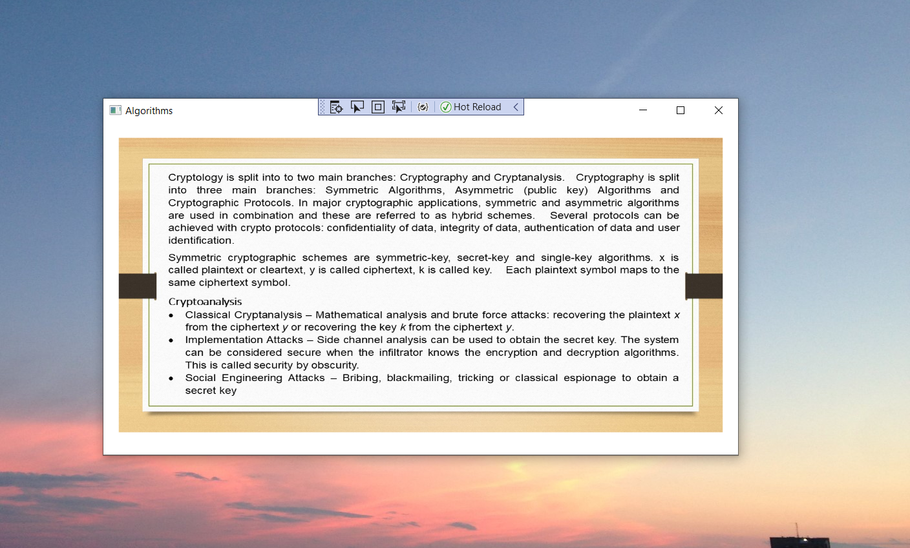
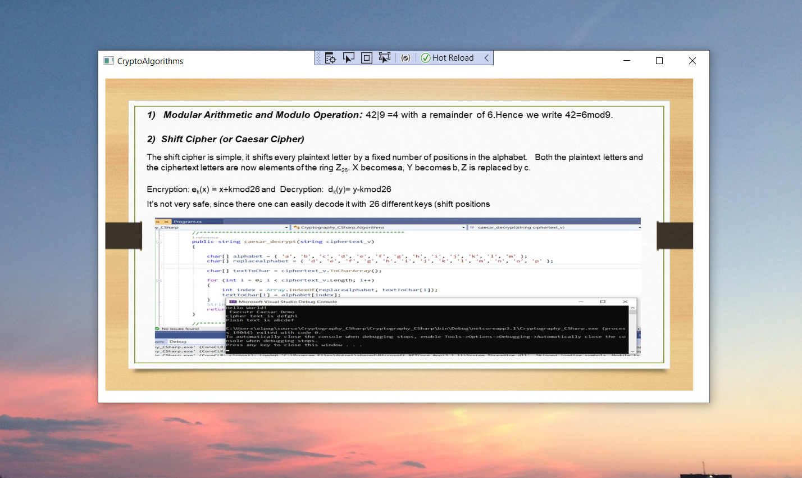
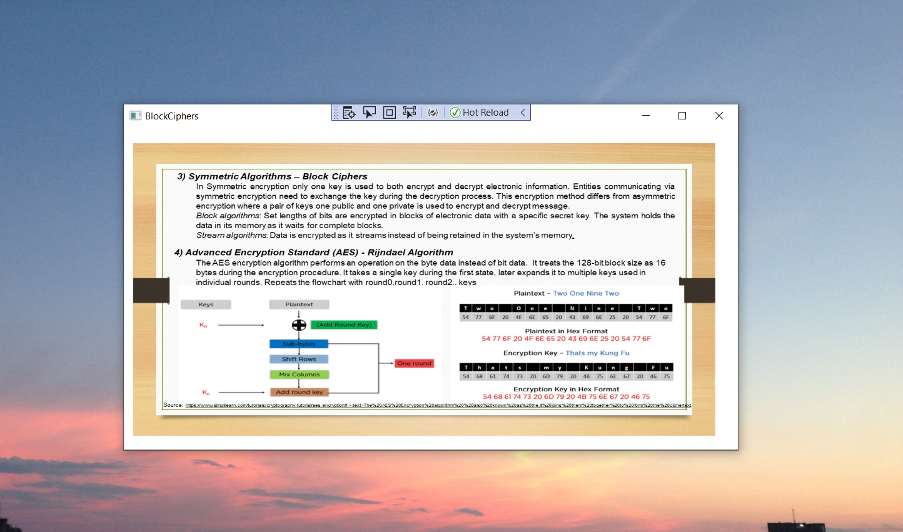
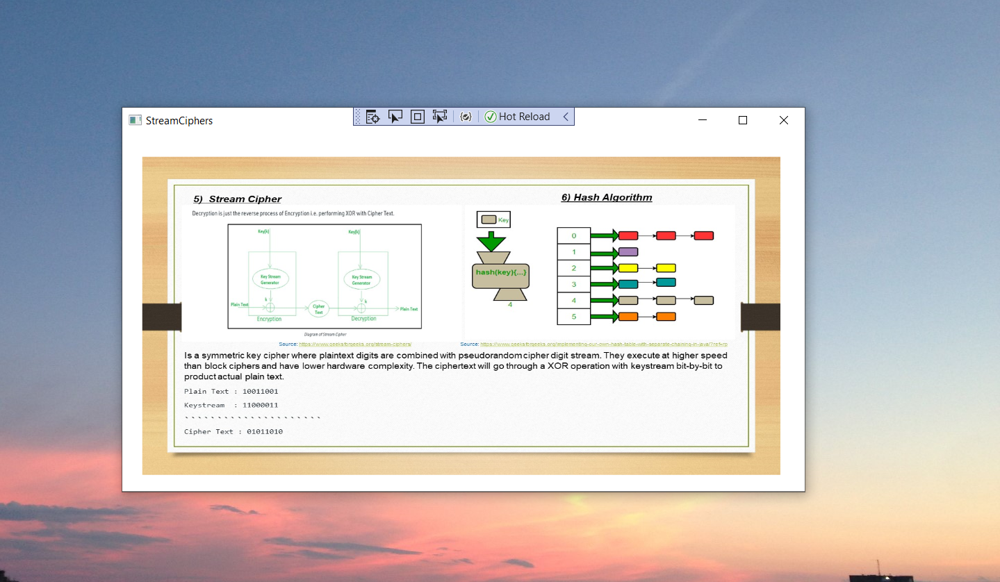
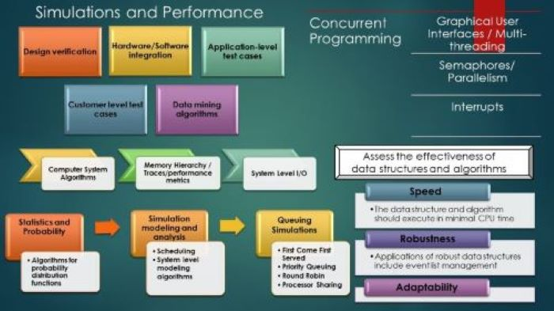
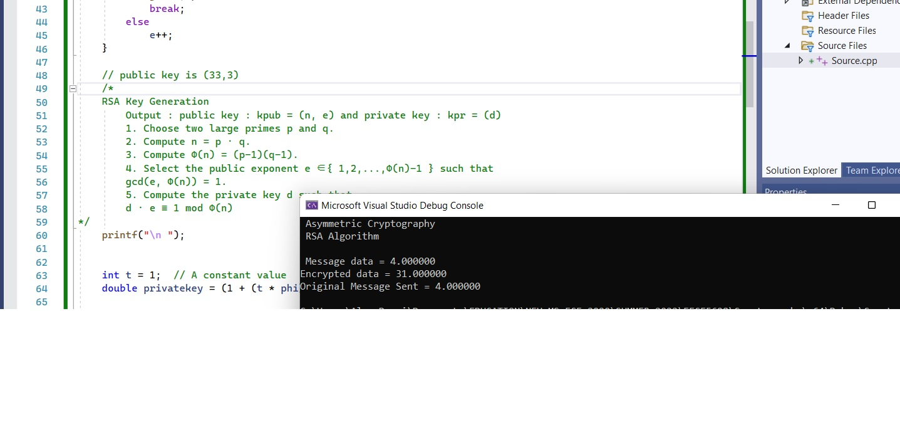

# Introduction To Cryptography

Provides an overview to the introduction of cryptography.

## Cryptoalgorithms

## Algorithms

## Block Cipher

## Stream Cipher

## Introduction to algorithms 

## Algorithms 

## RSA
### Understanding cryptography, geeksforgeeks.org

Additional details reference: https://github.com/alpaddesai/SoftwareEngineering
